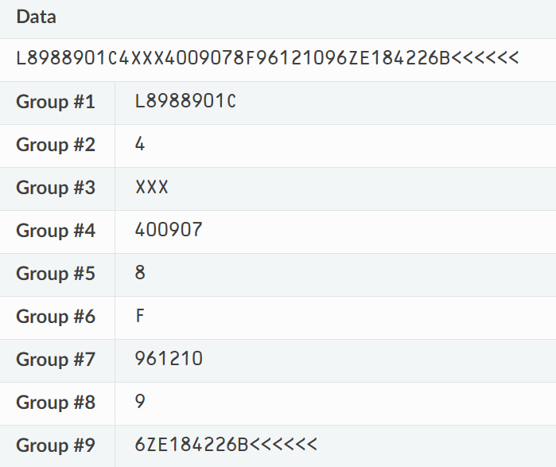

# Web Serial API Plugin with MRZ (Machine-Readable Zone) parser <a id="readme-top"></a> #

[](https://www.buymeacoffee.com/kgetov)


## Table of Contents (for general use of this plugin)

- [Host app - installation](#host-app-installation)
- [Host app - import, connect and read data](#host-app-usage)
- [Reading and parsing MRZ documents (type TD1, TD2, TD3, MRVA, MRVB)](#mrz-parser)

## Table of Contents (for future support and development)

- [Concepts and Usage](#concepts-and-ussage)
- [Interfaces](#interfaces)
- [In depth (Web Serial API)](#in-depth)
    - [Feature detection](#feature-detection)
    - [Open a serial port](#open-a-serial-port)
    - [Read from a serial port](#read-from-a-serial-port)
    - [Write to a serial port](#write-to-a-serial-port)
    - [Close a serial port](#close-a-serial-port)
    - [Listen to connection and disconnection](#listen-to-connect-disconnect)
    - [Handle signals](#handle-signals)
    - [Transforming streams](#transform-streams)
    - [Revoke access to a serial port](#revoke-access)
- [In depth (MRZ parser)](#in-depth-mrz)
    - [MRZ formats](#mrz-formats)
        - [TD1 - Parsing and specification](#td1)
        - [TD2 - Parsing and specification](#td2)
        - [TD3 - Parsing and specification](#td3)
        - [MRVA - Parsing and specification](#mrva)
        - [MRVB - Parsing and specification](#mrvb)
    - [Data validation](#data-validation)
- [Dev Tips](#dev-tips)
- [Browsers support](#browsers-support)

## Host app installation <a id="host-app-installation"></a> ##

Installing the package from NPM registry:

   ```sh
   npm i web-serial-api
   ```

or

   ```sh
   npm install <dir or repo to 'web-serial-api-(version).tgz'>
   ```

<p align="right">(<a href="#readme-top">back to top</a>)</p>

## Host app usage <a id="host-app-usage"></a> ##

### Import, connect and read the data from COM port <a id="connecting-to-com-port"></a> ###

`connect()` triggers the menu where the user will pick a device (it requires a user interaction to be
triggered).
It opens the port selected by the user in the UI using defined options like `baudRate`, `stopBits` etc. or options,
provided by the host app.
After opening the port, a `reader` is set.

Usage example (`connect()`, `readAny()`, `readMrz()`, `stopReading()` and `disconnect()`):

````typescript
import {Reader} from 'web-serial-api'

/* without options / predetermined device */
const reader = new Reader();

async function connect() {
    await reader.connect()
        .then(res => {
            console.log(res)
        })
        .catch(err => {
            console.log(err);
        });
}

// Read from any serial device
async function read() {
    await reader.readAny()
        .then(res => {
            console.log(`Res from read ${res}`)
        })
        .catch(err => {
            console.log(err);
        });
}

// Read MRZ (Machine-readable zone) and get parsed data
async function read() {
    await reader.readMrz()
        .then(res => {
            console.log(`Res from MRZ reader ${res}`)
        })
        .catch(err => {
            console.log(err);
        });
}

async function stopReading() {
    await reader.stopReading()
        .then(res => {
            console.log(res);
        })
        .catch(err => {
            console.log(err)
        });
}

async function disconnect() {
    await reader.disconnect()
        .then(res => {
            console.log(res);
        })
        .catch(err => {
            console.log(err)
        });
}
````

With options:

````ts
const reader = new Reader({
    baudRate: 11000,
    bufferSize: 255,
    dataBits: 8,
    flowControl: "none",
    parity: "none",
    stopBits: 1
});

async function connect() {
    await reader.connect()
        .then(res => {
            /*Do something after connection ex. auto trigger read()*/
        })
        .catch(err => {
            /*Handle errors*/
        });
}

/* read(), stopReading() etc. as described above */
````

at Vue template:

````vue

<div class="row">
<div class="column">
  <div>Actions:</div>
  <button @click="connect()">Connect</button>
  <button @click="readMrz()">Read</button>
  <button @click="stopReading()">Stop reading</button>
  <button @click="disconnect()">Disconnect</button>
</div>
</div>
<div class="row">
<div class="column mt-2">
  <p>Name: {{ documentData?.fields.firstName }}</p>
  <p>Last name: {{ documentData?.fields.lastName }}</p>
  <p>Document number: {{ documentData?.fields.documentNumber }}</p>
  <p>ID number: {{ documentData?.fields.optional2 }}</p>
</div>
</div>
````

<mark>All provided options are optional, except for baudRate.</mark>

### Connect to predetermined device ###

This plugin supports auto connection without the user's interaction.
If we set `autoConnectToPredeterminedDevice` with number, representing device position at the device list().

<mark>We can pass Serial Number (currently not all devices expose their SN)</mark>

Example (no options, auto connect to device #4 ):

````ts
const reader = new Reader(undefined, 4);

async function connect() {
    await reader.connect()
        .then(res => {
            console.log('Res: ', res);
        })
        .catch(err => {
            console.log('Error connecting', err);
        });
}
````

<p align="right">(<a href="#readme-top">back to top</a>)</p>

## Reading and parsing MRZ documents (type TD1, TD2, TD3, MRVA, MRVB) <a id="mrz-parser"></a> ##

### Reading MRZ ###

reader.readMrz() returns `Promise<DocumentModel>`

````typescript
async function readMrz() {
    await reader.readMrz()
        .then(res => {
            console.log(`Response from MRZ reader ${res}`)
        })
        .catch(err => {
            console.log(err);
        });
}
````

### About MRZ data props ###

- `format` - String identifying the format of the parsed MRZ.
  Supported formats are:
    - TD1 (identity card with three MRZ lines)
    - TD2 (identity card with two MRZ lines)
    - TD3 (passport)
    - SWISS_DRIVING_LICENSE
    - FRENCH_NATIONAL_ID


- `valid` - `true` if all fields are valid. `false` otherwise.


- `fields` - Object mapping field names to their respective value. The value is set to `null` if it is invalid.
  The value may be different from the raw value. For example `fields.sex` will be "male" when the raw value was "M".


- `details` - Array of objects describing all parsed fields.
    - label {string} - Full english term for the field.
    - field {string} - Name of the field in `fields`.
    - value {string} - Value of the field or `null`.
    - valid {boolean}
    - ranges {Array} - Array of ranges that are necessary to compute this field.
      Ranges are objects with `line`, `start`, `end` and `raw`.
    - line {number} - Index of the line where the field is located.
    - start {number} - Index of the start of the field in `line`.
    - end {number} - Index of the end of the field in `line`.
    - autocorrect - Array of objects containing all corrections (ex. blurry letters / numbers due to bad reading;
      similar
      to each other letters / numbers like `G` and `6`, `Z` and `2`, `B` and `8`).
      Autocorrect has the following structure:
        - line{number} - reading issue line number
        - column{number} - reading issue column number
        - original{string} - original document letter / number
        - corrected{string} - replacement of `original` letter / number (ex. replacement of `G` with `6`
          or `6` with `G` );

<p align="right">(<a href="#readme-top">back to top</a>)</p>

## Concepts and Usage <a id="concepts-and-ussage"></a> ##

The `Web Serial API` is one of a set of APIs that allow websites to communicate with peripherals connected
to a user's computer. It provides the ability to connect to devices that are required by the operating system to
communicate via the serial API, rather than USB which can be accessed via the `WebUSB API`, or input devices that
can be accessed via `WebHID API`.

## Interfaces <a id="interfaces"></a> ##

|  Interface   |                                         Description                                         |
|:------------:|:-------------------------------------------------------------------------------------------:|
|   `Serial`   | Provides attributes and methods for finding and connecting to serial ports from a web page. |
| `SerialPort` |                    Provides access to a serial port on the host device.                     |

<p align="right">(<a href="#readme-top">back to top</a>)</p>

# In depth <a id="in-depth"></a> #

## Feature detection <a id="feature-detection"></a> ##

To check if the Web Serial API is supported, use:

````ts
if ("serial" in navigator) {
    // The Web Serial API is supported.
}
````

<p align="right">(<a href="#readme-top">back to top</a>)</p>

## Open a serial port <a id="open-a-serial-port"></a> ##

The Web Serial API is asynchronous by design. This prevents the website UI from blocking when awaiting input,
which is important because serial data can be received at any time, requiring a way to listen to it.
To open a serial port, first access a `SerialPort` object. For this, you can either prompt the user to select
a single serial port by calling `navigator.serial.requestPort()` in response to a user gesture such as touch
or mouse click, or pick one from `navigator.serial.getPorts()` which returns a list of serial ports the website
has been granted access to.

````ts
document.querySelector('button').addEventListener('click', async () => {
    // Prompt user to select any serial port.
    const port = await navigator.serial.requestPort();
});
````

````ts
// Get all serial ports the user has previously granted the website access to.
const ports = await navigator.serial.getPorts();
````

The `navigator.serial.requestPort()` function takes an optional object literal that defines filters.
Those are used to match any serial device connected over USB with a mandatory USB vendor (`usbVendorId`)
and optional USB product identifiers (`usbProductId`).

````ts
// Filter on devices with the Arduino Uno USB Vendor/Product IDs.
const filters = [
    {usbVendorId: 0x2341, usbProductId: 0x0043},
    {usbVendorId: 0x2341, usbProductId: 0x0001}
];

// Prompt user to select an Arduino Uno device.
const port = await navigator.serial.requestPort({filters});

const {usbProductId, usbVendorId} = port.getInfo();
````

Calling `requestPort()` prompts the user to select a device and returns a `SerialPort` object.
Once you have a `SerialPort` object, calling `port.open()` with the desired baud rate will open the serial port.
The `baudRate` dictionary member specifies how fast data is sent over a serial line.
It is expressed in units of bits-per-second (bps).
Check your device's documentation for the correct value as all the data you send and receive will be gibberish
if this is specified incorrectly. For some USB and Bluetooth devices that emulate a serial port this value may
be safely set to any value as it is ignored by the emulation.

````ts
// Prompt user to select any serial port.
const port = await navigator.serial.requestPort();

// Wait for the serial port to open.
await port.open({baudRate: 9600});
````

You can also specify any of the options below when opening a serial port. These options are optional.

- `dataBits`: The number of data bits per frame (either 7 or 8).
- `stopBits`: The number of stop bits at the end of a frame (either 1 or 2).
- `parity`: The parity mode (either `none`, `even` or `odd`).
- `bufferSize`: The size of the read and write buffers that should be created (must be less than 16MB).
- `flowControl`: The flow control mode (either `none` or `hardware`).

<p align="right">(<a href="#readme-top">back to top</a>)</p>

## Read from a serial port <a id="read-from-a-serial-port"></a> ##

Input and output streams in the Web Serial API are handled by the Streams API.

After the serial port connection is established, the `readable` and `writable` properties from the `SerialPort`
object return a `ReadableStream` and a `WritableStream`. Those will be used to receive data from and send data to
the serial device. Both use `Uint8Array` instances for data transfer.

When new data arrives from the serial device, `port.readable.getReader().read()` returns two properties asynchronously:
the `value` and a `done` boolean. If `done` is true, the serial port has been closed or there is no more data coming in.
Calling `port.readable.getReader()` creates a reader and locks `readable` to it. While `readable` is `locked`,
the serial port can't be closed.

````ts
const reader = port.readable.getReader();

// Listen to data coming from the serial device.
while (true) {
    const {value, done} = await reader.read();
    if (done) {
        // Allow the serial port to be closed later.
        reader.releaseLock();
        break;
    }
    // value is a Uint8Array.
    console.log(value);
}
````

Some non-fatal serial port read errors can happen under some conditions such as buffer overflow, framing errors,
or parity errors. Those are thrown as exceptions and can be caught by adding another loop on top of the previous one
that checks `port.readable`. This works because as long as the errors are non-fatal, a new `ReadableStream` is created
automatically. If a fatal error occurs, such as the serial device being removed, then `port.readable` becomes null.

````ts
while (port.readable) {
    const reader = port.readable.getReader();

    try {
        while (true) {
            const {value, done} = await reader.read();
            if (done) {
                // Allow the serial port to be closed later.
                reader.releaseLock();
                break;
            }
            if (value) {
                console.log(value);
            }
        }
    } catch (error) {
        // TODO: Handle non-fatal read error.
    }
}
````

If the serial device sends text back, you can pipe `port.readable` through a `TextDecoderStream` as shown below.
A `TextDecoderStream` is a transform stream that grabs all `Uint8Array` chunks and converts them to strings.

````ts
const textDecoder = new TextDecoderStream();
const readableStreamClosed = port.readable.pipeTo(textDecoder.writable);
const reader = textDecoder.readable.getReader();

// Listen to data coming from the serial device.
while (true) {
    const {value, done} = await reader.read();
    if (done) {
        // Allow the serial port to be closed later.
        reader.releaseLock();
        break;
    }
    // value is a string.
    console.log(value);
}
````

You can take control of how memory is allocated when you read from the stream using a "Bring Your Own Buffer" reader.
Call `port.readable.getReader({ mode: "byob" })` to get the `ReadableStreamBYOBReader` interface and provide your own
`ArrayBuffer` when calling `read()`. Note that the Web Serial API supports this feature in Chrome 106 or later.

````ts
try {
    const reader = port.readable.getReader({mode: "byob"});
    // Call reader.read() to read data into a buffer...
} catch (error) {
    if (error instanceof TypeError) {
        // BYOB readers are not supported.
        // Fallback to port.readable.getReader()...
    }
}
````

Here's an example of how to reuse the buffer out of `value.buffer`:

````ts
const bufferSize = 1024; // 1kB
let buffer = new ArrayBuffer(bufferSize);

// Set `bufferSize` on open() to at least the size of the buffer.
await port.open({baudRate: 9600, bufferSize});

const reader = port.readable.getReader({mode: "byob"});
while (true) {
    const {value, done} = await reader.read(new Uint8Array(buffer));
    if (done) {
        break;
    }
    buffer = value.buffer;
    // Handle `value`.
}
````

Here's another example of how to read a specific amount of data from a serial port:

````ts
async function readInto(reader, buffer) {
    let offset = 0;
    while (offset < buffer.byteLength) {
        const {value, done} = await reader.read(
            new Uint8Array(buffer, offset)
        );
        if (done) {
            break;
        }
        buffer = value.buffer;
        offset += value.byteLength;
    }
    return buffer;
}

const reader = port.readable.getReader({mode: "byob"});
let buffer = new ArrayBuffer(512);
// Read the first 512 bytes.
buffer = await readInto(reader, buffer);
// Then read the next 512 bytes.
buffer = await readInto(reader, buffer);
````

<p align="right">(<a href="#readme-top">back to top</a>)</p>

## Write to a serial port <a id="write-to-a-serial-port"></a> ##

To send data to a serial device, pass data to `port.writable.getWriter().write()`.
Calling `releaseLock()` on `port.writable.getWriter()` is required for the serial port to be closed later.

````ts
const writer = port.writable.getWriter();

const data = new Uint8Array([104, 101, 108, 108, 111]); // hello
await writer.write(data);


// Allow the serial port to be closed later.
writer.releaseLock();
````

Send text to the device through a `TextEncoderStream` piped to `port.writable` as shown below.

````ts
const textEncoder = new TextEncoderStream();
const writableStreamClosed = textEncoder.readable.pipeTo(port.writable);

const writer = textEncoder.writable.getWriter();

await writer.write("hello");
````

<p align="right">(<a href="#readme-top">back to top</a>)</p>

## Close a serial port <a id="close-a-serial-port"></a> ##

`port.close()` closes the serial port if its `readable` and `writable` members are `unlocked`, meaning `releaseLock()`
has been
called for their respective reader and writer.

````ts
await port.close();
````

However, when continuously reading data from a serial device using a loop, `port.readable` will always be locked until
it encounters an error. In this case, calling `reader.cancel()` will force `reader.read()` to resolve immediately
with `{ value: undefined, done: true }` and therefore allowing the loop to call `reader.releaseLock()`.

````ts
// Without transform streams.

let keepReading = true;
let reader;

async function readUntilClosed() {
    while (port.readable && keepReading) {
        reader = port.readable.getReader();
        try {
            while (true) {
                const {value, done} = await reader.read();
                if (done) {
                    // reader.cancel() has been called.
                    break;
                }
                // value is a Uint8Array.
                console.log(value);
            }
        } catch (error) {
            // Handle error...
        } finally {
            // Allow the serial port to be closed later.
            reader.releaseLock();
        }
    }

    await port.close();
}

const closedPromise = readUntilClosed();

document.querySelector('button').addEventListener('click', async () => {
    // User clicked a button to close the serial port.
    keepReading = false;
    // Force reader.read() to resolve immediately and subsequently
    // call reader.releaseLock() in the loop example above.
    reader.cancel();
    await closedPromise;
});
````

Closing a serial port is more complicated when using transform streams (like `TextDecoderStream`
and `TextEncoderStream`).
Call `reader.cancel()` as before. Then call `writer.close()` and `port.close()`. This propagates errors through the
transform
streams to the underlying serial port. Because error propagation doesn't happen immediately, you need to use the
`readableStreamClosed` and `writableStreamClosed` promises created earlier to detect when `port.readable`
and `port.writable`
have been unlocked. Cancelling the `reader` causes the stream to be aborted; this is why you must catch and ignore the
resulting error.

````ts
// With transform streams.

const textDecoder = new TextDecoderStream();
const readableStreamClosed = port.readable.pipeTo(textDecoder.writable);
const reader = textDecoder.readable.getReader();

// Listen to data coming from the serial device.
while (true) {
    const {value, done} = await reader.read();
    if (done) {
        reader.releaseLock();
        break;
    }
    // value is a string.
    console.log(value);
}

const textEncoder = new TextEncoderStream();
const writableStreamClosed = textEncoder.readable.pipeTo(port.writable);

reader.cancel();
await readableStreamClosed.catch(() => { /* Ignore the error */
});

writer.close();
await writableStreamClosed;

await port.close();
````

<p align="right">(<a href="#readme-top">back to top</a>)</p>

## Listen to connection and disconnection <a id="listen-to-connect-disconnect"></a> ##

If a serial port is provided by a USB device then that device may be connected or disconnected from the system.
When the website has been granted permission to access a serial port, it should monitor the `connect` and `disconnect`
events.

````ts
navigator.serial.addEventListener("connect", (event) => {
    // TODO: Automatically open event.target or warn user a port is available.
});

navigator.serial.addEventListener("disconnect", (event) => {
    // TODO: Remove |event.target| from the UI.
    // If the serial port was opened, a stream error would be observed as well.
});
````

Prior to Chrome 89 the `connect` and `disconnect` events fired a custom `SerialConnectionEvent` object with the affected
`SerialPort` interface available as the port attribute. You may want to use `event.port` || `event.target` to handle the
transition.
<p align="right">(<a href="#readme-top">back to top</a>)</p>

## Handle signals <a id="handle-signals"></a> ##

After establishing the serial port connection, you can explicitly query and set signals exposed by the serial port for
device detection and flow control. These signals are defined as boolean values. For example, some devices such as
Arduino
will enter a programming mode if the Data Terminal Ready (DTR) signal is toggled.

Setting `output signals` and getting `input signals` are respectively done by calling `port.setSignals()` and
p`ort.getSignals()`.
See usage examples below.

````ts
// Turn off Serial Break signal.
await port.setSignals({break: false});

// Turn on Data Terminal Ready (DTR) signal.
await port.setSignals({dataTerminalReady: true});

// Turn off Request To Send (RTS) signal.
await port.setSignals({requestToSend: false});
````

````ts
const signals = await port.getSignals();
console.log(`Clear To Send:       ${signals.clearToSend}`);
console.log(`Data Carrier Detect: ${signals.dataCarrierDetect}`);
console.log(`Data Set Ready:      ${signals.dataSetReady}`);
console.log(`Ring Indicator:      ${signals.ringIndicator}`);
````

<p align="right">(<a href="#readme-top">back to top</a>)</p>

## Transforming streams <a id="transform-streams"></a> ##

When you receive data from the serial device, you won't necessarily get all of the data at once. It may be arbitrarily
chunked.
For more information, see `Streams API concepts`.

To deal with this, you can use some built-in transform streams such as `TextDecoderStream` or create your own transform
stream which allows you to parse the incoming stream and return parsed data. The transform stream sits between the
serial
device and the read loop that is consuming the stream. It can apply an arbitrary transform before the data is consumed.
Think of it like an assembly line: as a widget comes down the line, each step in the line modifies the widget, so that
by
the time it gets to its final destination, it's a fully functioning widget.

For example, consider how to create a transform stream class that consumes a stream and chunks it based on line breaks.
Its `transform()` method is called every time new data is received by the stream. It can either enqueue the data or save
it
for later. The `flush()` method is called when the stream is closed, and it handles any data that hasn't been processed
yet.

To use the transform stream class, you need to pipe an incoming stream through it. In the third code example under
`Read from a serial port`, the original input stream was only piped through a `TextDecoderStream`, so we need to call
`pipeThrough()` to pipe it through our new `LineBreakTransformer`.

````ts
class LineBreakTransformer {
    constructor() {
        // A container for holding stream data until a new line.
        this.chunks = "";
    }

    transform(chunk, controller) {
        // Append new chunks to existing chunks.
        this.chunks += chunk;
        // For each line breaks in chunks, send the parsed lines out.
        const lines = this.chunks.split("\r\n");
        this.chunks = lines.pop();
        lines.forEach((line) => controller.enqueue(line));
    }

    flush(controller) {
        // When the stream is closed, flush any remaining chunks out.
        controller.enqueue(this.chunks);
    }
}
````

````ts
const textDecoder = new TextDecoderStream();
const readableStreamClosed = port.readable.pipeTo(textDecoder.writable);
const reader = textDecoder.readable
    .pipeThrough(new TransformStream(new LineBreakTransformer()))
    .getReader();
````

For debugging serial device communication issues, use the `tee()` method of `port.readable` to split the streams going
to or
from the serial device. The two streams created can be consumed independently and this allows you to print one to the
console for inspection.

````ts
const [appReadable, devReadable] = port.readable.tee();

// You may want to update UI with incoming data from appReadable
// and log incoming data in JS console for inspection from devReadable.
````

<p align="right">(<a href="#readme-top">back to top</a>)</p>

## Revoke access to a serial port <a id="revoke-access"></a> ##

The website(or app) can clean up permissions to access a serial port it is no longer interested in retaining by calling
`forget()` on the `SerialPort` instance. For example, for an educational web application used on a shared computer with
many
devices, a large number of accumulated user-generated permissions creates a poor user experience.

````ts
// Voluntarily revoke access to this serial port.
await port.forget();
````

As` forget()` is available in Chrome 103 or later, check if this feature is supported with the following:

````ts
if ("serial" in navigator && "forget" in SerialPort.prototype) {
    // forget() is supported.
}
````

<p align="right">(<a href="#readme-top">back to top</a>)</p>

## In depth (Machine-Readable Zone)  <a id="in-depth-mrz"></a> ##

There are 3 main formats: `TD1`, `TD2`, `TD3` and Visas (`MRVA` and `MRVB`).

Here are some samples we’ll use in the next sections:


## TD1 - Parsing and specification  <a id="td1"></a> ##

### Specification ###

This format is defined in [Machine Readable Travel Documents Part 5: Specifications for TD1 Size Machine
Readable Official Travel Documents (MROTDs)](./assets/documents/9303_p5_cons_en.pdf) document.

Here is a sample image:


Here is the format:


<p align="right">(<a href="#readme-top">back to top</a>)</p>

### Parsing TD1 format ###

TD1 format has 3 lines, each has 30 characters.

#### Line 1 (TD1#1) ####

#### Regular expression (TD1#1) ####

<table>
  <tr>
    <th>Regular expression</th>
    <td>
        <code>([A|C|I][A-Z0-9<]{1})([A-Z]{3})([A-Z0-9<]{9})([0-9]{1})([A-Z0-9<]{15})</code>
    </td>
  </tr>
  <tr>
    <th>Group #1</th>
    <td>Document type. `A`, `C` or `I` as the first character.</td>
  </tr>
  <tr>
    <th>Group #2</th>
    <td>3 letters country code.</td>
  </tr>
  <tr>
    <th>Group #3</th>
    <td>Document number, up to 9 alphanumeric characters.</td>
  </tr>
  <tr>
    <th>Group #4</th>
    <td>Check digit on the document number.</td>
  </tr>
  <tr>
    <th>Group #5</th>
    <td>Optional data at the discretion of the issuing state.</td>
  </tr>
</table>

#### Sample result (TD1#1) ####


<p align="right">(<a href="#readme-top">back to top</a>)</p>

#### Line 2 (TD1#2) ####

#### Regular expression (TD1#2) ####

<table>
  <tr>
    <th>Regular expression</th>
    <td>
        <code>([0-9]{6})([0-9]{1})([M|F|X|<]{1})([0-9]{6})([0-9]{1})([A-Z]{3})([A-Z0-9<]{11})([0-9]{1})</code>
    </td>
  </tr>
  <tr>
    <th>Group #1</th>
    <td>Holder’s date of birth in format `YYMMDD`.</td>
  </tr>
  <tr>
    <th>Group #2</th>
    <td>Check digit on the date of birth.</td>
  </tr>
  <tr>
    <th>Group #3</th>
    <td>Sex of holder.</td>
  </tr>
  <tr>
    <th>Group #4</th>
    <td>Date of expiry of the document in format `YYMMDD`.</td>
  </tr>
  <tr>
    <th>Group #5</th>
    <td>Check digit on date of expiry.</td>
  </tr>
  <tr>
    <th>Group #6</th>
    <td>Nationality of the holder represented by a three-letter code.</td>
  </tr>
  <tr>
    <th>Group #7</th>
    <td>Optional data at the discretion of the issuing state.</td>
  </tr>
  <tr>
    <th>Group #8</th>
    <td>Overall check digit for upper and middle MRZ lines.</td>
  </tr>
</table>

#### Sample result (TD1#2) ####


<p align="right">(<a href="#readme-top">back to top</a>)</p>

#### Line 3 (TD1#3) ####

#### Regular expression (TD1#3) ####

<table>
  <tr>
    <th>Regular expression</th>
    <td>
        <code>([A-Z0-9<]{30})</code>
    </td>
  </tr>
  <tr>
    <th>Group #1</th>
    <td>Names</td>
  </tr>
</table>

#### Sample result (TD1#3) ####


<p align="right">(<a href="#readme-top">back to top</a>)</p>

## TD2 - Parsing and specification  <a id="td2"></a> ##

### Specification ###

This format is defined in [Machine Readable Travel Documents Part 6: Specifications for TD2
Size Machine Readable Official Travel Documents (MROTDs)](./assets/documents/9303_p6_cons_en.pdf) document.

Here is a sample image:


Here is the format:


<p align="right">(<a href="#readme-top">back to top</a>)</p>

### Parsing TD2 format ###

TD2 format has 2 lines, each has 36 characters.

#### Line 1 (TD2#1) ####

#### Regular expression (TD2#1) ####

<table>
  <tr>
    <th>Regular expression</th>
    <td>
        <code>([A|C|I][A-Z0-9<]{1})([A-Z]{3})([A-Z0-9<]{31})</code>
    </td>
  </tr>
  <tr>
    <th>Group #1</th>
    <td>Document type. `A`, `C` or `I` as the first character.</td>
  </tr>
  <tr>
    <th>Group #2</th>
    <td>3 letters country code.</td>
  </tr>
  <tr>
    <th>Group #3</th>
    <td>Primary Identifier.</td>
  </tr>
</table>

#### Sample result (TD2#1) ####


<p align="right">(<a href="#readme-top">back to top</a>)</p>

#### Line 2 (TD2#2) ####

#### Regular expression (TD2#2) ####

<table>
  <tr>
    <th>Regular expression</th>
    <td>
        <code>([A-Z0-9<]{9})([0-9]{1})([A-Z]{3})([0-9]{6})([0-9]{1})([M|F|X|<]{1})([0-9]{6})([0-9]{1})([A-Z0-9<]{7})([0-9]{1})</code>
    </td>
  </tr>
  <tr>
    <th>Group #1</th>
    <td>Document number, up to 9 alphanumeric characters.</td>
  </tr>
  <tr>
    <th>Group #2</th>
    <td>Check digit on document number.</td>
  </tr>
  <tr>
    <th>Group #3</th>
    <td>Nationality. 3 letters country code.</td>
  </tr>
  <tr>
    <th>Group #4</th>
    <td>Holder’s date of birth.</td>
  </tr>
  <tr>
    <th>Group #5</th>
    <td>Check digit on the date of birth.</td>
  </tr>
  <tr>
    <th>Group #6</th>
    <td>Sex of holder.</td>
  </tr>
  <tr>
    <th>Group #7</th>
    <td>Date of expiry of the document.</td>
  </tr>
  <tr>
    <th>Group #8</th>
    <td>Check digit on the date of expiry.</td>
  </tr>
  <tr>
    <th>Group #9</th>
    <td>Optional data at the discretion of the issuing state.</td>
  </tr>
  <tr>
    <th>Group #10</th>
    <td>Overall check digit</td>
  </tr>
</table>

#### Sample result (TD2#2) ####


<p align="right">(<a href="#readme-top">back to top</a>)</p>

## TD3 - Parsing and specification  <a id="td3"></a> ##

### Specification ###

This format is defined in [ Machine Readable Travel Documents Part 4: Specifications for
Machine Readable Passports (MRPs) and other TD3 Size MRTDs](./assets/documents/9303_p4_cons_en.pdf) document.

Here is a sample image:


Here is the format:


<p align="right">(<a href="#readme-top">back to top</a>)</p>

### Parsing TD3 format ###

TD3 format has 2 lines, each has 44 characters.

#### Line 1 (TD3#1) ####

#### Regular expression (TD3#1) ####

<table>
  <tr>
    <th>Regular expression</th>
    <td>
        <code>(P[A-Z0-9<]{1})([A-Z]{3})([A-Z0-9<]{39})</code>
    </td>
  </tr>
  <tr>
    <th>Group #1</th>
    <td>Document type. `P` as the first character.</td>
  </tr>
  <tr>
    <th>Group #2</th>
    <td>3 letters country code.</td>
  </tr>
  <tr>
    <th>Group #3</th>
    <td>Primary Identifier.</td>
  </tr>
</table>

#### Sample result (TD3#1) ####


<p align="right">(<a href="#readme-top">back to top</a>)</p>

#### Line 2 (TD3#2) ####

#### Regular expression (TD3#2) ####

<table>
  <tr>
    <th>Regular expression</th>
    <td>
        <code>([A-Z0-9<]{9})([0-9]{1})([A-Z]{3})([0-9]{6})([0-9]{1})([M|F|X|<]{1})([0-9]{6})([0-9]{1})([A-Z0-9<]{14})([0-9]{1})([0-9]{1})</code>
    </td>
  </tr>
  <tr>
    <th>Group #1</th>
    <td>Document number, up to 9 alphanumeric characters.</td>
  </tr>
  <tr>
    <th>Group #2</th>
    <td>Check digit on document number.</td>
  </tr>
  <tr>
    <th>Group #3</th>
    <td>Nationality. 3 letters country code.</td>
  </tr>
  <tr>
    <th>Group #4</th>
    <td>Holder’s date of birth.</td>
  </tr>
  <tr>
    <th>Group #5</th>
    <td>Check digit on the date of birth.</td>
  </tr>
  <tr>
    <th>Group #6</th>
    <td>Sex of holder.</td>
  </tr>
  <tr>
    <th>Group #7</th>
    <td>Date of expiry of the document.</td>
  </tr>
  <tr>
    <th>Group #8</th>
    <td>Check digit on the date of expiry.</td>
  </tr>
  <tr>
    <th>Group #9</th>
    <td>Optional data at the discretion of the issuing state.</td>
  </tr>
  <tr>
    <th>Group #10</th>
    <td>Check digit on the optional data.</td>
  </tr>
  <tr>
    <th>Group #11</th>
    <td>Overall check digit</td>
  </tr>
</table>

#### Sample result (TD3#2) ####


<p align="right">(<a href="#readme-top">back to top</a>)</p>

## Visas ##

This format is defined in [Machine Readable Travel Documents Part 7: Machine Readable
Visas](./assets/documents/9303_p7_cons_en.pdf) document and have two subtypes: MRVA and MRVB.

## MRVA - Parsing and specification  <a id="mrva"></a> ##

### Specification ###

Here is a sample image:


Here is the format:


<p align="right">(<a href="#readme-top">back to top</a>)</p>

### Parsing MRVA format ###

MRVA format has 2 lines, each has 44 characters.

#### Line 1 (MRVA#1) ####

#### Regular expression (MRVA#1) ####

<table>
  <tr>
    <th>Regular expression</th>
    <td>
        <code>(V[A-Z0-9<]{1})([A-Z]{3})([A-Z0-9<]{39})</code>
    </td>
  </tr>
  <tr>
    <th>Group #1</th>
    <td>Document type. `V` as the first character.</td>
  </tr>
  <tr>
    <th>Group #2</th>
    <td>3 letters country code.</td>
  </tr>
  <tr>
    <th>Group #3</th>
    <td>Primary Identifier.</td>
  </tr>
</table>

#### Sample result (MRVA#1) ####


<p align="right">(<a href="#readme-top">back to top</a>)</p>

#### Line 2 (MRVA#2) ####

#### Regular expression (MRVA#2) ####

<table>
  <tr>
    <th>Regular expression</th>
    <td>
        <code>([A-Z0-9<]{9})([0-9]{1})([A-Z]{3})([0-9]{6})([0-9]{1})([M|F|X|<]{1})([0-9]{6})([0-9]{1})([A-Z0-9<]{16})</code>
    </td>
  </tr>
  <tr>
    <th>Group #1</th>
    <td>Document number, up to 9 alphanumeric characters.</td>
  </tr>
  <tr>
    <th>Group #2</th>
    <td>Check digit on document number.</td>
  </tr>
  <tr>
    <th>Group #3</th>
    <td>Nationality. 3 letters country code.</td>
  </tr>
  <tr>
    <th>Group #4</th>
    <td>Holder’s date of birth.</td>
  </tr>
  <tr>
    <th>Group #5</th>
    <td>Check digit on the date of birth.</td>
  </tr>
  <tr>
    <th>Group #6</th>
    <td>Sex of holder.</td>
  </tr>
  <tr>
    <th>Group #7</th>
    <td>Date of expiry of the document.</td>
  </tr>
  <tr>
    <th>Group #8</th>
    <td>Check digit on the date of expiry.</td>
  </tr>
  <tr>
    <th>Group #9</th>
    <td>Optional data at the discretion of the issuing state.</td>
  </tr>
</table>

#### Sample result (MRVA#2) ####



<p align="right">(<a href="#readme-top">back to top</a>)</p>

## MRVB - Parsing and specification  <a id="mrvb"></a> ##

### Specification ###

Here is a sample image:


Here is the format:


<p align="right">(<a href="#readme-top">back to top</a>)</p>

### Parsing MRVB format ###

MRVB format has 2 lines, each has 36 characters.

#### Line 1 (MRVB#1) ####

#### Regular expression (MRVB#1) ####

<table>
  <tr>
    <th>Regular expression</th>
    <td>
        <code>(V[A-Z0-9<]{1})([A-Z]{3})([A-Z0-9<]{31})</code>
    </td>
  </tr>
  <tr>
    <th>Group #1</th>
    <td>Document type. `V` as the first character.</td>
  </tr>
  <tr>
    <th>Group #2</th>
    <td>3 letters country code.</td>
  </tr>
  <tr>
    <th>Group #3</th>
    <td>Primary Identifier.</td>
  </tr>
</table>

#### Sample result (MRVB#1) ####


<p align="right">(<a href="#readme-top">back to top</a>)</p>

#### Line 2 (MRVB#2) ####

#### Regular expression (MRVB#2) ####

<table>
  <tr>
    <th>Regular expression</th>
    <td>
        <code>([A-Z0-9<]{9})([0-9]{1})([A-Z]{3})([0-9]{6})([0-9]{1})([M|F|X|<]{1})([0-9]{6})([0-9]{1})([A-Z0-9<]{8})</code>
    </td>
  </tr>
  <tr>
    <th>Group #1</th>
    <td>Document number, up to 9 alphanumeric characters.</td>
  </tr>
  <tr>
    <th>Group #2</th>
    <td>Check digit on document number.</td>
  </tr>
  <tr>
    <th>Group #3</th>
    <td>Nationality. 3 letters country code.</td>
  </tr>
  <tr>
    <th>Group #4</th>
    <td>Holder’s date of birth.</td>
  </tr>
  <tr>
    <th>Group #5</th>
    <td>Check digit on the date of birth.</td>
  </tr>
  <tr>
    <th>Group #6</th>
    <td>Sex of holder.</td>
  </tr>
  <tr>
    <th>Group #7</th>
    <td>Date of expiry of the document.</td>
  </tr>
  <tr>
    <th>Group #8</th>
    <td>Check digit on the date of expiry.</td>
  </tr>
  <tr>
    <th>Group #9</th>
    <td>Optional data at the discretion of the issuing state.</td>
  </tr>
</table>

#### Sample result (MRVB#2) ####


<p align="right">(<a href="#readme-top">back to top</a>)</p>

## Data validation  <a id="data-validation"></a> ##

What is nice with the MRZ / MRTD specifications is that they contain different check digits to make sure that 
the most important fields (`document number`, `expiry date`, `date of birth`…) are valid.

A check digit consists of a single digit computed from the other digits in a series. Check digits in the MRZ 
are calculated on specified numerical data elements in the MRZ. The check digits permit readers to verify that data 
in the MRZ is correctly interpreted.

A special check digit calculation has been adopted for use in MRTDs. The check digits shall be calculated on 
modulus 10 with a continuously repetitive weighting of `731` `731` …, as follows:

- `Step 1.` Going from left to right, multiply each digit of the pertinent numerical data element by the weighting figure 
appearing in the corresponding sequential position.
- `Step 2.` Add the products of each multiplication.
- `Step 3.` Divide the sum by 10 (the modulus).
- `Step 4.` The remainder shall be the check digit.

For data elements in which the number does not occupy all available character positions, the symbol `<` shall be used to 
complete vacant positions and shall be given the value of zero for the purpose of calculating the check digit.

When the check digit calculation is applied to data elements containing alphabetic characters, the characters `A` to `Z` 
shall have the values `10` to `35` consecutively, as follows:

<table>
  <tr>
    <th>A</th>
    <td>10</td>
  </tr>
  <tr>
    <th>B</th>
    <td>11</td>
  </tr>
  <tr>
    <th>C</th>
    <td>12</td>
  </tr>
  <tr>
    <th>...</th>
    <td>...</td>
  </tr>
  <tr>
    <th>X</th>
    <td>33</td>
  </tr>
  <tr>
    <th>Y</th>
    <td>34</td>
  </tr>
  <tr>
    <th>Z</th>
    <td>35</td>
  </tr>
</table>

<p align="right">(<a href="#readme-top">back to top</a>)</p>

## Dev Tips  <a id="dev-tips"></a> ##

Debugging the Web Serial API in Chrome is easy with the internal page, `about://device-log` where you can see all serial
device related events in one single place.
<p align="right">(<a href="#readme-top">back to top</a>)</p>

## Browsers support <a id="browsers-support"></a> ##

|               | [](http://godban.github.io/browsers-support-badges/)<br/>Chrome | [](http://godban.github.io/browsers-support-badges/)<br/>Edge | [](http://godban.github.io/browsers-support-badges/)<br/>Firefox | [](http://godban.github.io/browsers-support-badges/)<br/>Opera | [](http://godban.github.io/browsers-support-badges/)<br/>Safari | [](http://godban.github.io/browsers-support-badges/)<br/>Chrome Android |  [](http://godban.github.io/browsers-support-badges/)<br/>Firefox Android   | [](http://godban.github.io/browsers-support-badges/)<br/>Opera Android | [](http://godban.github.io/browsers-support-badges/)<br/>iOS Safari | [](http://godban.github.io/browsers-support-badges/)<br/> Samsung |
|:-------------:|:-------------------------------------------------------------------------------------------------------------------------------------------------------------------------------------------------------------:|:----------------------------------------------------------------------------------------------------------------------------------------------------------------------------------------------------------:|:-----------------------------------------------------------------------------------------------------------------------------------------------------------------------------------------------------------------:|:---------------------------------------------------------------------------------------------------------------------------------------------------------------------------------------------------------:|:-------------------------------------------------------------------------------------------------------------------------------------------------------------------------------------------------------------:|:---------------------------------------------------------------------------------------------------------------------------------------------------------------------------------------------------------------------:|:----------------------------------------------------------------------------------------------------------------------------------------------------------------------------------------------------------------------------:|:-----------------------------------------------------------------------------------------------------------------------------------------------------------------------------------------------------------------:|:-----------------------------------------------------------------------------------------------------------------------------------------------------------------------------------------------------------------------------:|:------------------------------------------------------------------------------------------------------------------------------------------------------------------------------------------------------------------------------------:|
|   `Serial`    |                                                                                                      89                                                                                                       |                                                                                                     89                                                                                                     |                                                                                                         -                                                                                                         |                                                                                                    75                                                                                                     |                                                                                                       -                                                                                                       |                                                                                                           -                                                                                                           |                                                                                                              -                                                                                                               |                                                                                                         -                                                                                                         |                                                                                                               -                                                                                                               |                                                                                                                  -                                                                                                                   |
|  `getPorts`   |                                                                                                      89                                                                                                       |                                                                                                     89                                                                                                     |                                                                                                         -                                                                                                         |                                                                                                    75                                                                                                     |                                                                                                       -                                                                                                       |                                                                                                           -                                                                                                           |                                                                                                              -                                                                                                               |                                                                                                         -                                                                                                         |                                                                                                               -                                                                                                               |                                                                                                                  -                                                                                                                   |
| `requestPort` |                                                                                                      89                                                                                                       |                                                                                                     89                                                                                                     |                                                                                                         -                                                                                                         |                                                                                                    75                                                                                                     |                                                                                                       -                                                                                                       |                                                                                                           -                                                                                                           |                                                                                                              -                                                                                                               |                                                                                                         -                                                                                                         |                                                                                                               -                                                                                                               |                                                                                                                  -                                                                                                                   |

<p align="right">(<a href="#readme-top">back to top</a>)</p>
